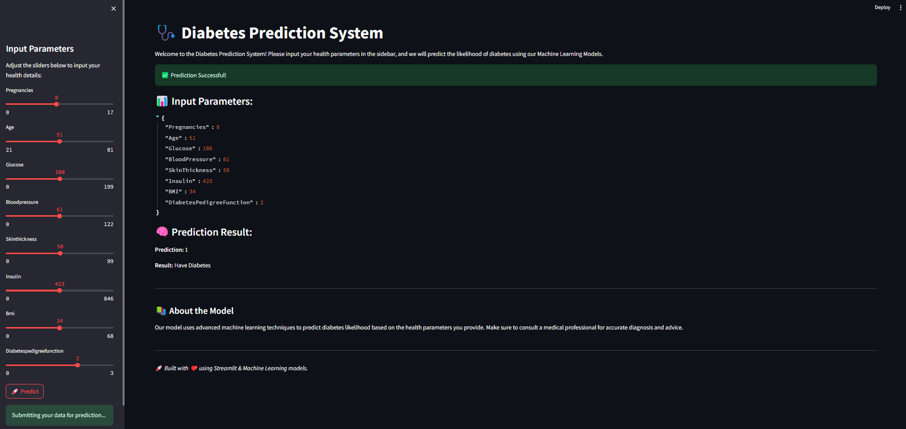

# FrontEnd-Streamlit Code

This Python script creates a web-based interface using **Streamlit** for a **Disease Prediction System**. Users can input various health parameters and receive predictions from a backend API.

---
# WebPage



## Key Features

### Libraries Used:
- **Streamlit**: For the user interface.
- **Requests**: To send data to the backend API.
- **JSON**: To handle data configurations and input.
- **OS**: For file path management.
- **Math**: For rounding slider values.

### Input Parameters:
Users can adjust the following health metrics using sliders:
- Pregnancies
- Age
- Glucose
- BloodPressure
- SkinThickness
- Insulin
- BMI
- DiabetesPedigreeFunction

---

## Workflow

1. **Dynamic Configuration:**
   - Loads slider ranges from a configuration file `streamlit_options.json`.
   - Dynamically creates sliders in the Streamlit sidebar.

2. **User Interaction:**
   - Collects user input for health parameters.

3. **API Integration:**
   - Sends the user input as JSON to the API endpoint `http://localhost:8008/predict` via a `POST` request.
   - Displays the API's prediction result alongside the user input.

---

## Code Overview

### **Streamlit App Code**
```python
import math
import streamlit as st
import requests
import os
import json
st.set_page_config(
    page_title="Diabetes Prediction System",
    page_icon="🩺",
    layout="wide",
    initial_sidebar_state="expanded"
)


st.title('🩺 Diabetes Prediction System')
st.write("""
Welcome to the Diabetes Prediction System! Please input your health parameters in the sidebar, and we will predict the likelihood of diabetes using our Machine Learning Models.
""")


user_options = {}
current_dir = os.path.dirname(os.path.abspath(__file__))
file_path = os.path.join(current_dir, "streamlit_options.json")

try:
    with open(file_path, 'r') as file:
        StreamLit_SlideBar = json.load(file)
except FileNotFoundError:
    st.error("Configuration file not found. Please ensure 'streamlit_options.json' exists.")
    st.stop()


st.sidebar.title("Input Parameters")
st.sidebar.write("Adjust the sliders below to input your health details:")

for field_name, range_values in StreamLit_SlideBar.get("slider_fields", {}).items():
    min_val, max_val = range_values
    default_value = round((min_val + max_val) / 2)
    user_options[field_name] = st.sidebar.slider(
        f"{field_name.replace('_', ' ').title()}",
        min_val, max_val,
        value=default_value
    )

if st.sidebar.button('🚀 Predict') or st.button('Predict'):
    st.sidebar.success('Submitting your data for prediction...')
    
    try:
        data = json.dumps(user_options, indent=2)
        response = requests.post('http://159.203.101.120:8008/predict', data=data)
        
        if response.status_code == 200:
            result = response.json()
            st.success('✅ Prediction Successful!')
            st.write("### 📊 Input Parameters:")
            st.json(user_options)
            
            st.write("### 🧠 Prediction Result:")
            st.write(f"**Prediction:** {result.get('prediction')}")
            st.write(f"**Result:** {'Diabetes' if result.get('prediction') == 1 else 'No Diabetes'}")
        else:
            st.error(f"❌ Error: {response.status_code} - {response.text}")
    
    except requests.exceptions.RequestException as e:
        st.error(f"❌ Connection Error: {e}")
st.markdown("---")
st.write("""
#### 📚 About the Model
Our model uses advanced machine learning techniques to predict diabetes likelihood based on the health parameters you provide. 
Make sure to consult a medical professional for accurate diagnosis and advice.
""")

st.markdown("---")
st.write("🚀 *Built with ❤️ using Streamlit & Machine Learning models.*")
```

---

## Outputs

1. **User Input Display:**
   - Shows the user-selected values for all parameters.
   
2. **API Response Display:**
   - Outputs the prediction received from the backend API (e.g., `{"prediction": 1}`).

---

## Example Input & Output

### Input:
- Pregnancies: 3  
- Age: 30  
- Glucose: 120  
- BloodPressure: 80  
- SkinThickness: 20  
- Insulin: 150  
- BMI: 25.0  
- DiabetesPedigreeFunction: 0.5  

### Output:
- **User Input:** Displays the above input values.
- **Prediction:** A JSON response from the API (e.g., `{"prediction": 1}`).

---

## How to Run
1. Ensure `streamlit_options.json` is in the same directory as the script.
2. Run the application using:
   ```bash
   streamlit run StreamLitApp.py
   ```
3. Adjust the sliders, click **Predict**, and view the results.
